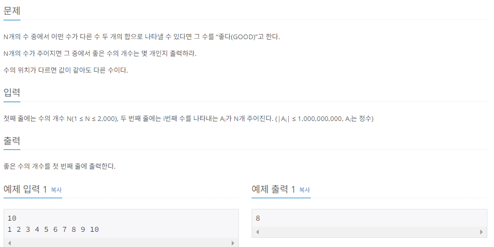

## **🔒 난이도**
> 🟡 골드   
  
  
  
## **🔒 문제**
> https://www.acmicpc.net/problem/1253  



## 🔓**내풀이**
[Do-it C++ 코딩테스트 참고](https://www.inflearn.com/course/lecture?courseSlug=%EB%91%90%EC%9E%87-%EC%95%8C%EA%B3%A0%EB%A6%AC%EC%A6%98-%EC%BD%94%EB%94%A9%ED%85%8C%EC%8A%A4%ED%8A%B8-%EC%94%A8%EC%81%A0%EC%81%A0&unitId=148477)  

처음 써보는 투포인터{ O(n) }를 사용하였다. 앞으로 코딩테스트를 풀 때 만약 두 수라는 단어가 들어간다면 투 포인터를 생각해 봐야한다.  
정렬을 한 뒤 가장 앞부분과 뒷부분을 합하여 가며 올바른 인덱스 조합을 찾아낸다.
```c++
#include "pch.h"
#include <iostream>
#include <vector>
#include <algorithm>
using namespace std;

int main() {

	int N;
	cin >> N;
	vector<int> A(N, 0);

	for (int i = 0; i < N; i++) {
		cin >> A[i];
	}

	sort(A.begin(), A.end());

	int count = 0;

	for (int K = 0; K < N; K++) {
		int find = A[K];
		int i = 0;
		int j = N - 1;
		while (i < j) {
			if (A[i] + A[j] == find) {
				if (i != K && j != K) {
					count++;
					break;
				}
				else if (i == K)
					i++;
				else if (j == K)
					j--;
			}
			else if (A[i] + A[j] < find)
				i++;
			else
				j--;
		}
	}
	cout << count << endl;
}
```